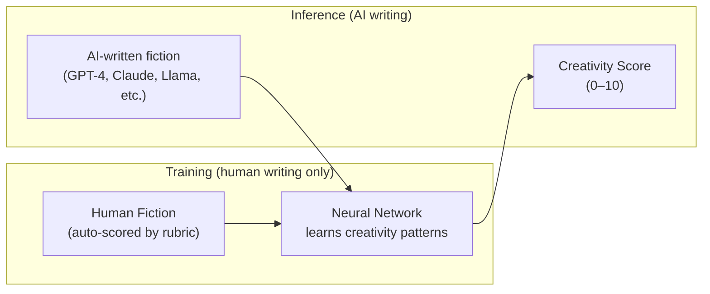
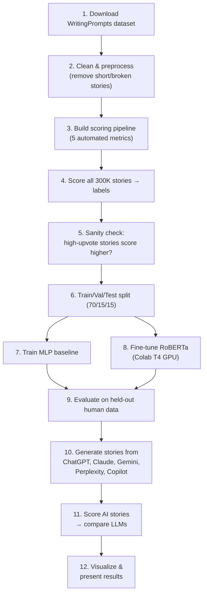

# AI Creativity Judge — Final Project Plan ✅

> **Core idea:** Train a model *only* on human creative writing, auto-scored by a deterministic creativity rubric. Then score AI-written stories and compare which LLMs are most creative.

---

## 1. Problem Framing



- **Training data:** Human-written fiction only, each labeled with an automated creativity score
- **Model learns:** What makes writing creative according to our rubric
- **Test time:** Feed in AI-written fiction from multiple LLMs → compare scores
- **Hypothesis:** Some LLMs will approach human-level creativity scores, others won't

---

## 2. The Automated Scoring Rubric

Every story runs through the **same deterministic pipeline** — same inputs always produce the same score. The rubric *defines* what creativity means for this project.

### Five Dimensions → Composite Score (0–10)

| Dimension | Weight | Computation | What it captures |
|---|---|---|---|
| **Lexical Richness** | 20% | Type-Token Ratio + hapax legomena % | Vocabulary diversity & rare word use |
| **Syntactic Complexity** | 15% | Avg dependency parse depth + subordinate clause ratio (spaCy) | Sentence sophistication |
| **Novelty** | 25% | TF-IDF surprise vs corpus mean + rare bigram ratio | How different from "average" writing |
| **Imagery** | 20% | Sensory/concrete word ratio (NRC or imageability lexicons) | Descriptive & figurative richness |
| **Narrative Dynamics** | 20% | Sentiment arc variance (VADER) + entity intro pacing | Story structure & tension |

```python
def score_story(text, corpus_stats):
    lex   = lexical_richness(text)              # TTR + hapax
    syn   = syntactic_complexity(text)           # spaCy parse depth
    nov   = novelty_score(text, corpus_stats)    # TF-IDF surprise
    img   = imagery_score(text)                  # sensory word density
    narr  = narrative_dynamics(text)             # sentiment variance

    # Each sub-score normalized to 0–10
    composite = (0.20*lex + 0.15*syn + 0.25*nov + 0.20*img + 0.20*narr)
    return composite  # 0–10
```

### Why This Works (Methodological Defense)

> [!IMPORTANT]
> **Anticipate this question from your professor:** *"But creativity is subjective — how can you automate it?"*

1. **Consistency over subjectivity** — Human raters disagree. An automated rubric applies the *exact same standard* to every text. Subjectivity is confined to the rubric design, which is documented and cited.
2. **Grounded in literature** — Each dimension maps to established NLP creativity metrics used in published research on creative writing evaluation.
3. **Reproducible** — Anyone can re-run the scoring pipeline and get identical results.
4. **The model learns *beyond* the rubric** — RoBERTa sees raw text, not just the 5 features. If deeper creativity patterns exist, the transformer can discover them. The rubric is the training signal, not a ceiling.

### Sanity Check

High-upvote Reddit stories should score *higher* than random stories. If they do → your rubric captures something real about quality.

---

## 3. Dataset Strategy

### Training Data (Human Writing Only)

| Dataset | Size | Description | Source |
|---|---|---|---|
| **Reddit WritingPrompts (FAIR)** | 300K stories | Prompt-response pairs, all human-written | [Kaggle](https://www.kaggle.com/) |
| **Popular Reddit Short Stories** | 4,308 stories | Pre-filtered by upvotes (>1K post, >200 story) — quality signal | [Kaggle](https://www.kaggle.com/) |
| **ROCStories** | 50K stories | Clean five-sentence narratives | Research corpus |
| **Project Gutenberg excerpts** | Thousands | Classic literature passages | [gutenberg.org](https://www.gutenberg.org/) |

> [!TIP]
> **Recommended combination:** Use **Reddit WritingPrompts** as the core (largest, fiction-focused, prompt-story pairs), supplement with **Popular Reddit Short Stories** for the sanity check. The prompt-story structure also gives you a natural way to generate comparable AI stories from the same prompts.

### AI Test Data (Inference Only)

1. Select ~50-100 prompts from your training set
2. Feed each prompt to 5 LLMs: **ChatGPT, Claude, Gemini, Perplexity, Copilot**
3. Collect generated short stories (~500 words each)
4. Score with your trained model
5. Compare creativity distributions across LLMs

---

## 4. Model Architecture

### Primary: Fine-tuned RoBERTa for Regression

```
[Story] → RoBERTa Tokenizer → RoBERTa-base → [CLS] embedding → Linear(768→1) → Score (0–10)
```

- Use `AutoModelForSequenceClassification` with `num_labels=1`
- Loss: MSE or Huber loss
- Fine-tune 3–5 epochs, lr=2e-5
- ~125M parameters, trainable on Google Colab T4 GPU (~2-4 hours)

### Baseline: Feature-based MLP

```
[Story] → Feature extraction → [TTR, perplexity, burstiness, ...] → MLP(20→64→32→1) → Score
```

- Uses the **same 5 rubric features** plus additional engineered features (sentence length variance, punctuation density, Flesch readability)
- Simpler, fully interpretable
- **Comparison story for your presentation:** *"Does the deep learning model discover creativity patterns beyond our hand-crafted features?"*

> [!TIP]
> If RoBERTa significantly outperforms the MLP → it learned creativity patterns beyond the 5 explicit metrics. If not → the rubric features alone are sufficient. Either result is a meaningful finding.

### Input Length Handling

Transformers have a 512-token limit (~400 words). For longer stories:

| Strategy | How it works | Trade-off |
|---|---|---|
| **Truncate** | Use first 512 tokens | Simplest — good fit for ~500 word stories |
| **Sliding window** | Score overlapping 512-token chunks, average | Backup if stories run longer |

> **Truncation is the default** since we're targeting ~500 word short stories, which fit neatly in the 512-token window.

---

## 5. Tech Stack

| Component | Tool |
|---|---|
| Language | Python 3.10+ |
| Deep Learning | PyTorch + Hugging Face Transformers |
| NLP Features | spaCy, NLTK, VADER (sentiment) |
| Data | Hugging Face Datasets, Pandas |
| Training | Hugging Face `Trainer` API |
| Metrics | scikit-learn (MSE, MAE, R²), scipy (Spearman/Pearson) |
| Visualization | Matplotlib, Seaborn |
| Experiment Tracking | TensorBoard or Weights & Biases (optional) |
| GPU | Google Colab (T4 GPU, free tier) |

---

## 6. Project Pipeline



---

## 7. Timeline

| Date | Milestone | Owner |
|---|---|---|
| **Now – Mar 6** | Finalize rubric, write abstract | All |
| **Mar 6 – Mar 12** | Download data, build preprocessing pipeline | Steven |
| **Mar 12 – Mar 16** | Build & test the 5 scoring functions | Steven + Theo |
| **Mar 16 – Mar 23** | Score all stories, run sanity checks, create splits | Steven |
| **Mar 23 – Apr 6** | Train MLP baseline + fine-tune RoBERTa | Theo |
| **Apr 6 – Apr 18** | Generate AI stories, score them, compare LLMs | Steven + Theo |
| **Apr 18 – Apr 27** | Build results UI / visualizations, final presentation | David + All |

---

## Confirmed Decisions

- **LLMs to test:** ChatGPT, Claude, Gemini, Perplexity, Copilot
- **Story length:** Short stories (~500 words)
- **Compute:** Google Colab T4 GPU (free tier)
- **Scoring:** Fully automated rubric (no manual annotation)
- **Dataset size:** Full 300K Reddit WritingPrompts corpus
